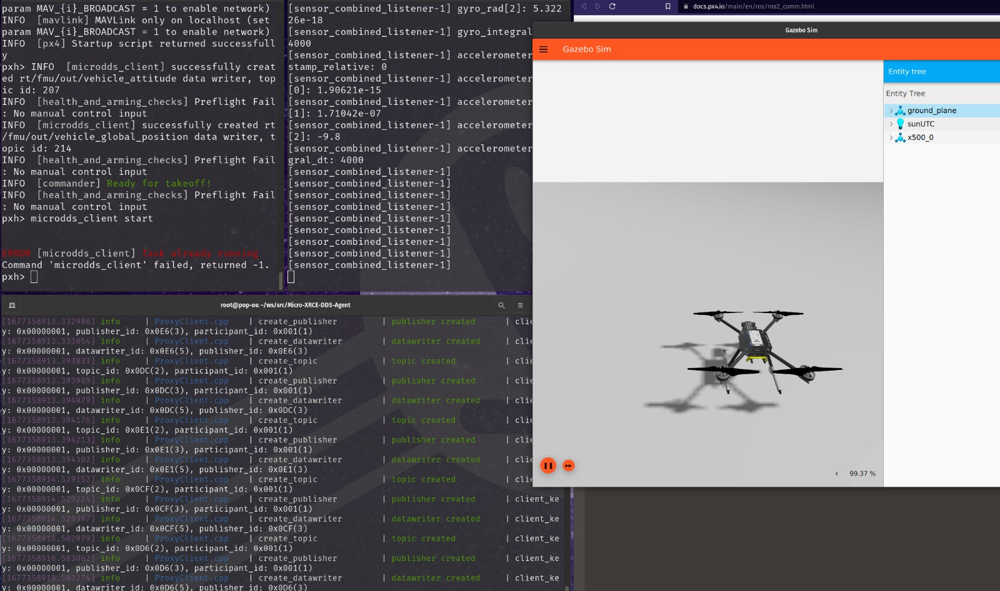

# PX4 Humble Gazebo Docker SITL setup

A simple dockerised implementation of starting PX4 SITL

## TLDR

First run `build.sh`, then for the first time after startup `run.sh`.
For the next runs you can use `start.sh`.
CLI access through `docker exec -it px4 bash`.
`build.sh` will take about 10 mins to download based on internet speed.
Humble is installed, but not all required packages are mentioned (WIP).

## Files explained

- `Dockerfile`: The Dockerfile (WIP)
- `build.sh`: builds Docker image
- `requirements.txt`: python requirements for ros2 and PX4
- `run.sh`: starts a container based on image, attaches volumes for code
    - `ws`: a volume for workspace, put src and packages for everything here
    - `source_this.sh`: sources ros setup scripts
- `remove-all.sh`: deletes all docker images, volumes and containers
- `start.sh`: attach to container interactively (sort of login to container)
- `stop.sh`: stops and delets all running containers


## Packages needed for simulation

- [Micro-XRCE-DDS-Agent](https://github.com/eProsima/Micro-XRCE-DDS)
- [PX4\_msgs](https://github.com/PX4/px4_msgs)
- [PX4\_ros\_com](https://github.com/PX4/px4_ros_com)

To run the simulations once in the container (refer [this](https://docs.px4.io/main/en/ros/ros2_comm.html):
```bash
# Build and install XRCE-DDS
cd <relavant folder>
mkdir build
cd build
cmake ..
make
sudo make install
sudo ldconfig /usr/local/lib/

# Start XRCE agent
MicroXRCEAgent udp4 -p 8888

# Build and run PX4 simulation
cd <PX4-Autopilot directory>
make px4_sitl gz_x500

# To run example script from PX4_ros_com
source /opt/ros/humble/setup.bash
cd <workspace directory>
colcon build
source install/local_setup.bash
ros2 launch px4_ros_com sensor_combined_listener.launch.py
```



## Potential errors

Some errors I faced during setup

- PX4\_ros\_com won't build: datatype timestamp string format error
    - Solution: Building the PX4\_msgs and XRCE-DDS packages first (??) worked
    for me
- PX4\_ros\_com won't launch: Missing comma in line 55
    - Solution: add in the comma and rebuild
- microdds\_client wont start: task already running
    - Solution: Task already running, you don't need to run it manually

## References
- [ubuntu.sh](https://github.com/PX4/PX4-Autopilot/blob/main/Tools/setup/ubuntu.sh)
    - script used to install alll dependancies, not needed to be run
    - Dockerfile contains all needed depends already
- [requirements.txt](https://github.com/PX4/PX4-Autopilot/blob/main/Tools/setup/requirements.txt)
    - coppied into requirements.txt, run in Dockerfile
- [PX4 Docs (imp)](https://docs.px4.io/main/en/ros/ros2_comm.html)
